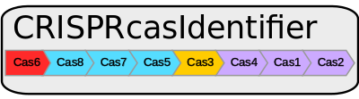

[](https://github.com/BackofenLab/CRISPRcasIdentifier/releases/tag/v1.1.0) [](https://scicrunch.org/scicrunch/Resources/record/nlx_144509-1/SCR_018296/resolver?q=SCR_018296&l=SCR_018296) [](https://bio.tools/crisprcasidentifier)

CRISPRcasIdentifier is an effective machine learning approach for the identification and classification of CRISPR-Cas systems. It consists of a holistic strategy which allows us to: (i) combine regression and classification approaches for improving the quality of the input protein cassettes and predicting their subtypes with high accuracy; (ii) to detect signature genes for the different subtypes; (iii) to extract several types of information for each protein, such as potential rules that reveal the identity of neighboring genes; and (iv) define a complete and extensible framework able to integrate newly discovered Cas proteins and CRISPR subtypes. We achieve balanced accuracy scores above 0.95 in the classification experiment of CRISPR subtypes, mean absolute error values below 0.05 for the prediction of the normalized bit-score of different Cas proteins and a balanced accuracy of 0.89 in our benchmarking against other available tools.

## Citation

If you use CRISPRcasIdentifier, please cite our paper: [CRISPRCasIdentifier: Machine learning for accurate identification and classification of CRISPR-Cas systems](https://academic.oup.com/gigascience/article/9/6/giaa062/5858408) Victor A. Padilha, Omer S. Alkhnbashi, Shiraz A. Shah, André C. P. L. F. de Carvalho, Rolf Backofen, GigaScience, 2020, DOI: [10.1093/gigascience/giaa062](https://doi.org/10.1093/gigascience/giaa062).

## Releases

**Version 1.1.0:** includes HMM and Machine Learning (ML) models trained on the same datasets from v1.0.0 and the most recent dataset published by [Makarova (2019)](https://www.nature.com/articles/s41579-019-0299-x). These models are now the default parameters of the tool (if you want to use the HMM and ML models from the previous version, please read about the `-s` parameter in [How to use](#how-to-use)).

**Version 1.0.0:** includes HMM and Machine Learning models trained on the datasets published by [Makarova et al (2015)](https://www.nature.com/articles/nrmicro3569), [Shmakov et al (2015)](https://www.sciencedirect.com/science/article/pii/S1097276515007753) and [Shmakov et al(2017)](https://www.nature.com/articles/nrmicro.2016.184). This is the paper submission version.

## Installation and requirements

CRISPRcasIdentifier has been tested with Python 3.7.6. To run it, we recommend installing the same library versions we used. Since we exported our classifiers following the [model persistence guideline from scikit-learn](https://scikit-learn.org/stable/modules/model_persistence.html), it is not guaranteed that they will work properly if loaded using other Python and/or library versions. For such, we recommend the use of our docker image or a conda virtual environment. They make it easy to install the correct Python and library dependencies without affecting the whole operating system (see below).

### First step: download the last version of the tool and extract it

```
wget https://github.com/BackofenLab/CRISPRcasIdentifier/archive/v1.1.0.tar.gz
tar -xzf v1.1.0.tar.gz
```

### Second step: download the Hidden Markov (HMM) and Machine Learning (ML) models

Due to GitHub's file size constraints, we made our HMM and ML models available in Google Drive. You can download them [here](https://drive.google.com/file/d/1YbTxkn9KuJP2D7U1-6kL1Yimu_4RqSl1/view?usp=sharing) and [here](https://drive.google.com/file/d/1Nc5o6QVB6QxMxpQjmLQcbwQwkRLk-thM/view?usp=sharing). Save both tar.gz files inside CRISPRcasIdentifier's directory. It is not necessary to extract them, since the tool will do that the first time it is run.

From commandline, this an be done using the [`gdown`]() tool.

```sh
pip install gdown
gdown --fuzzy https://drive.google.com/file/d/1YbTxkn9KuJP2D7U1-6kL1Yimu_4RqSl1/view?usp=sharing
gdown --fuzzy https://drive.google.com/file/d/1Nc5o6QVB6QxMxpQjmLQcbwQwkRLk-thM/view?usp=sharing
```


Next, you can choose which third step to follow: either [using a docker container](#third-step-docker) or [using a conda environment](#third-step-conda).

### Third step (docker)

First, you need to install docker (please refer to its [installation guideline](https://docs.docker.com/get-docker/) for details). Next, you can either [pull our image from DockerHub](#pull-the-image-from-dockerhub) or [build the image manually](#build-the-image).

#### Pull the image from DockerHub

```
docker pull padilha/crispr-cas-identifier:1.0.0
```

Inside CRISPRcasIdentifier's directory, run the docker image.

```
docker run --rm -v "$(pwd):/home/crispr/CRISPRcasIdentifier" -it padilha/crispr-cas-identifier:1.0.0 /bin/bash
```

Since we are using the volume option (-v), CRISPRcasIdentifier's directory will be shared between the host machine and the docker container. Thus, there is no need to move files from one to the other.

After this step, everything should be set up and you can skip to [How to use](#how-to-use).

#### Build the image

Inside CRISPRcasIdentifier's directory, build the image from the Dockerfile.

```
docker build -t crispr-cas-identifier .
```

Inside CRISPRcasIdentifier's directory, run the docker image.

```
docker run --rm -v "$(pwd):/home/crispr/CRISPRcasIdentifier" -it crispr-cas-identifier:latest /bin/bash
```

Since we are using the volume option (-v), CRISPRcasIdentifier's directory will be shared between the host machine and the docker container. Thus, there is no need to move files from one to the other.

After this step, everything should be set up and you can skip to [How to use](#how-to-use).

### Third step (conda)

Another way to install the correct python version and its dependencies to run CRISPRcasIdentifier is by using [miniconda](https://docs.conda.io/en/latest/miniconda.html).

Install Miniconda.

```
wget https://repo.anaconda.com/miniconda/Miniconda3-latest-Linux-x86_64.sh
chmod +x Miniconda3-latest-Linux-x86_64.sh
./Miniconda3-latest-Linux-x86_64.sh
```

Create and activate environment for CRISPRcasIdentifier.

```
conda env create -f crispr-env.yml -n crispr-env
conda activate crispr-env
```

After using CRISPRcasIdentifier you can deactivate the environment.

```
conda deactivate
```

After this step, everything should be set up and you can skip to [How to use](#how-to-use).

## How to use

To list the available command line arguments type

    python CRISPRcasIdentifier.py -h

The available options are:

* `-h` : displays the help message.

* `-f path/to/file.fa` : input fasta file path (it can be either protein or DNA, see `-st` and `-sc` for details).

* `-r reg1 reg2 ...` : list of regressors to use. Available options: CART, ERT or SVM (default: ERT).

* `-c clf1 clf2 ...` : list of classifiers to use. Available options: CART, ERT or SVM (default: ERT).

* `-p` : returns class probabilities. When the probability output is not required, the ML models always return the label with the maximum probability value (independent of how high the value of this probability is). When using the `-p` option, we want CRISPRcasIdentifier to give some clues to the user about how well a test cassette agrees with different subtypes (given that some subtypes have some Cas proteins in common). _If the user wants to label a test example based on the probabilities, that must be done by assigning it to the subtype with the maximum probability value returned and not by using some threshold_. Finally, for a given test example, the probabilities sum up to one.

* `-s HMMi HMMj ...` : list of HMM models to use, available options: HMM1 to HMM5 and HMM2019 (default: HMM2019). The models HMM1 to HMM5 are the ones that were originally used in our paper. HMM2019 consists on the HMM models that were obtained from the most recent dataset by [Makarova (2019)](https://www.nature.com/articles/s41579-019-0299-x). Setting this parameter is enough for the tool to know which ML models should be used.

* `-ho` : hmmsearch output directory (default: `./output/hmmsearch`). If the directory does not exist, it is created.

* `-co` : cassette output directory (default: `./output/cassette`). If the directory does not exist, it is created.

* `-st` : sequence type contained in input fasta file. Available options: `protein` or `dna` (default: `protein`). If `-st` is set to `protein`, CRISPRcasIdentifier assumes that the input fasta file contains only one cassette. For such, the expected cassette length is up to 15 proteins (more than that might produce unexpected results). If `-st` is set to `dna`, CRISPRcasIdentifier tries to build the protein cassettes after extracting the protein sequences using [Prodigal](https://github.com/hyattpd/Prodigal). In this case, CRISPRcasIdentifier may produce predictions for multiple cassettes. Also note that for DNA data, the option `-sc` _must_ also be set.

* `-sc` : sequence completeness (used only when `-st` is set to `dna`). Available options: `complete` or `partial` (default: `complete`).

* `-m` : run mode. Available options: `classification`, `regression` or `combined` (default: `combined`).

* `-o` : output csv file path (default: `./output/predictions.csv`).

## Examples

We provide three simple examples in the `examples` directory:

* `NC_013722.fasta` : DNA example. That must be run as `python CRISPRcasIdentifier.py -f examples/NC_013722.fasta -st dna -sc complete`

* `example1.fa` and `example2.fa` : Protein examples. Those must be run as:
    * `python CRISPRcasIdentifier.py -f examples/example1.fa`
    * `python CRISPRcasIdentifier.py -f examples/example2.fa`

## License (GPLv3)

    CRISPRcasIdentifier
    Copyright (C) 2020 Victor Alexandre Padilha <victorpadilha@usp.br>,
                       Omer Salem Alkhnbashi <alkhanbo@informatik.uni-freiburg.de>,
                       Shiraz Ali Shah <shiraz.shah@dbac.dk>,
                       André Carlos Ponce de Leon Ferreira de Carvalho <andre@icmc.usp.br>,
                       Rolf Backofen <backofen@informatik.uni-freiburg.de>

    This program is free software: you can redistribute it and/or modify
    it under the terms of the GNU General Public License as published by
    the Free Software Foundation, either version 3 of the License, or
    (at your option) any later version.

    This program is distributed in the hope that it will be useful,
    but WITHOUT ANY WARRANTY; without even the implied warranty of
    MERCHANTABILITY or FITNESS FOR A PARTICULAR PURPOSE.  See the
    GNU General Public License for more details.

    You should have received a copy of the GNU General Public License
    along with this program.  If not, see <https://www.gnu.org/licenses/>.
